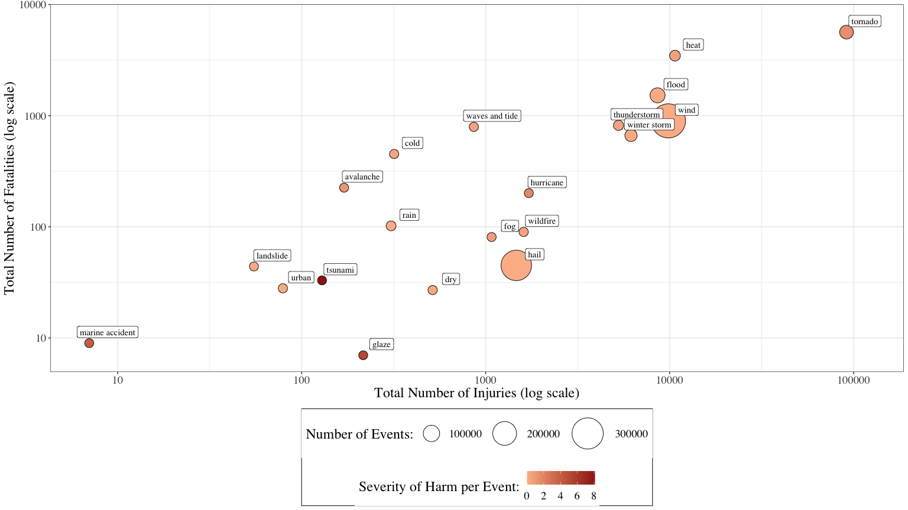
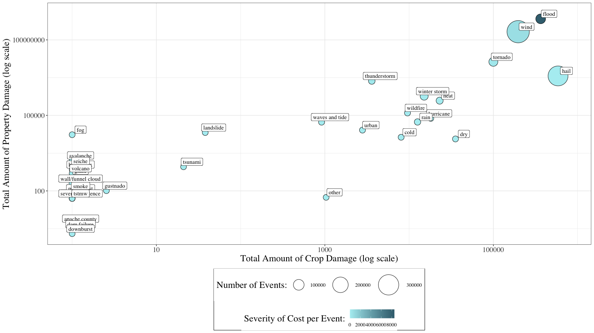

*Coursera Course: Reproducible Research, Peer Assessment 2*


```r
library(tidyverse)
library(janitor)
options(scipen = 999)  # this removes any scientific notation formatting of numbers
```

# Synopsis

This report examines six decades (1950-2011) of storm event data from the U.S. [National Oceanic and Atmospheric Administration](https://www.noaa.gov/) (NOAA) Storm Database. The purpose of this study is to answer two questions related to the effects of storm events. Both questions consider storm events at a national scale in the United States. The first question pertains to population health effects of storms, as defined by injuries and fatalities. The total number of injuries and fatalities from tornadoes, heat, wind, flood, thunderstorms, and winter storms rate the highest need for concern. The second question pertains to economic consequences of storms, as defined by crop damage and property damage. The total dollar amount of crop damage and property damage from floods, wind, tornadoes, and hail rate the highest need for concern. Attention should be given to the three storm types on both lists: tornadoes, wind, and floods.

The code for this report can be viewed in full [on Github](https://github.com/bretsw/storm-effects/).

# Data Processing

The events in the dataset start in the year 1950 and end in November 2011. In the earlier years of the database there are generally fewer events recorded, most likely due to a lack of good records. More recent years should be considered more complete.

Because the file size, the dataset is saved in a compressed .bz2 file. However, this file type can still be read directly into R using the **dplyr** `read_csv()` function. Once the dataset has been loaded into R, I did some data processing, such as making the column names (i.e., variables) easier to work with using the `clean_names()` function from the **janitor** package. I also immediately removed odd storm event types, such as those denoted by "summary", "other", "none", and "?". 

The dollar amounts of property damage were listed in an odd way: a number value in one column (`propdmg`) and the order of magnitude, or exponential value, in a separate column (`propdmgexp`). I combined these two columns into one, whole number, value for property damage, `property_damage`.  Some of the `propdmgexp` values were unclear. So, for full disclosure, I interpreted the exponents to mean:

- **blank**, **NA**, and **0** mean no exponent (i.e., 10^0 = 1), or the identity
- **h** for hundred (100), **k** for kilo, or thousand (1,000), **m** for million (1,000,000), **b** for billion (1,000,000,000)
- **2-7** to mean 10^x, so 10^2, 10^3, 10^4, and so on


```r
storm_data <- 
  read_csv("repdata_data_StormData.csv.bz2", col_names = TRUE) 

n_observations_init <- nrow(storm_data)

storm_data <- 
  storm_data %>%
  clean_names() %>%
  filter(!grepl("summary", evtype),
         evtype != "other",
         evtype != "none",
         evtype != "?"
         )

storm_data <- 
  storm_data %>%
  mutate(propdmgexp = if_else(propdmg == 0,
                              "",
                              tolower(propdmgexp)
                              ),
         propdmgexp = if_else(is.na(propdmgexp),
                              "",
                              if_else(propdmgexp == "0",
                                      "",
                                      propdmgexp
                                      )
                              ),
         property_damage = if_else(propdmgexp == "",
                                   propdmg,
                                   if_else(propdmgexp == "h",
                                           propdmg * 100,
                                           if_else(propdmgexp == "k",
                                                   propdmg * 1000,
                                                   if_else(propdmgexp == "m",
                                                           propdmg * 1000000,
                                                           if_else(propdmgexp == "b",
                                                                   propdmg * 1000000000,
                                                                   propdmg
                                                                   )
                                                           )
                                                   )
                                           )
                                   ),
         property_damage = if_else(propdmgexp == "2",
                                   propdmg * 10^2,
                                   if_else(propdmgexp == "3",
                                           propdmg * 10^3,
                                           if_else(propdmgexp == "4",
                                                   propdmg * 10^4,
                                                   if_else(propdmgexp == "5",
                                                           propdmg * 10^5,
                                                           if_else(propdmgexp == "6",
                                                                   propdmg * 10^6,
                                                                   if_else(propdmgexp == "7",
                                                                           propdmg * 10^7,
                                                                           propdmg
                                                                           )
                                                                   )
                                                           )
                                                   )
                                           )
                                   )
         )
```

The next issue with the dataset is that the observed values of storm event types (`evtype`) contained typos, ambiguous entries, and similarly-themed-but-distinct entries.


```r
n_storm_types_init <- storm_data$evtype %>% unique() %>% length()  # 977
```

Before cleaning, the dataset contained 902297 rows, or observations, of 976 different types of storm events. Closer examination showed that many of the these event types overlapped, sometimes due to typos, capitalization differences, or slight variations in phrasing (e.g., "wind gusts" vs. "wind advisory"). As a result, I used the `grepl()` function to identify different clusters of storm events, and I then consolidated these to reduce the number of categories of storm types.


```r
storm_data <- 
  storm_data %>%
  mutate(evtype = tolower(evtype))
storm_data <- 
  storm_data %>%
  mutate(evtype = if_else(grepl("snow", evtype, fixed=TRUE),
                          "winter storm",
                          if_else(grepl("blizzard", evtype, fixed=TRUE),
                                  "winter storm",
                                  if_else(grepl("freez", evtype, fixed=TRUE),
                                          "winter storm",
                                          if_else(grepl("wint", evtype, fixed=TRUE),
                                                  "winter storm",
                                                  if_else(grepl("ice", evtype, fixed=TRUE),
                                                          "winter storm",
                                                          if_else(grepl("sleet", evtype, fixed=TRUE),
                                                                  "winter storm",
                                                                  if_else(grepl("icy", evtype, fixed=TRUE),
                                                                          "winter storm",
                                                                          evtype
                                                                          )
                                                                  )
                                                          )
                                                  )
                                          )
                                  )
                          )
         )
storm_data <- 
  storm_data %>%
  mutate(evtype = if_else(grepl("hail", evtype, fixed=TRUE),
                          "hail",
                          if_else(grepl("volcan", evtype, fixed=TRUE),
                                  "volcano",
                                  if_else(grepl("fog", evtype, fixed=TRUE),
                                          "fog",
                                          evtype
                                          )
                                  )
                          )
         )
storm_data <- 
  storm_data %>%
  mutate(evtype = if_else(grepl("hurricane", evtype, fixed=TRUE),
                          "hurricane",
                          if_else(grepl("tropic", evtype, fixed=TRUE),
                                  "hurricane",
                                  if_else(grepl("typhoon", evtype, fixed=TRUE),
                                          "hurricane",
                                          if_else(grepl("floyd", evtype, fixed=TRUE),
                                                  "hurricane",
                                                  evtype
                                                  )
                                          )
                                  )
                          )
         )
storm_data <- 
  storm_data %>%
  mutate(evtype = if_else(grepl("high waves", evtype, fixed=TRUE),
                          "waves and tide",
                          if_else(grepl("wind and wave", evtype, fixed=TRUE),
                                  "waves and tide",
                                  if_else(grepl("rogue wave", evtype, fixed=TRUE),
                                          "waves and tide",
                                          if_else(grepl("tide", evtype, fixed=TRUE),
                                                  "waves and tide",
                                                  if_else(grepl("surf", evtype, fixed=TRUE),
                                                          "waves and tide",
                                                          if_else(grepl("coast", evtype, fixed=TRUE),
                                                                  "waves and tide",
                                                                  if_else(grepl(" seas", evtype, fixed=TRUE),
                                                                          "waves and tide",
                                                                          if_else(grepl("swell", evtype, fixed=TRUE),
                                                                                  "waves and tide",
                                                                                  if_else(grepl("current", evtype, fixed=TRUE),
                                                                                          "waves and tide",
                                                                                          if_else(grepl("surge", evtype, fixed=TRUE),
                                                                                                  "waves and tide",
                                                                                                  if_else(grepl("beach", evtype, fixed=TRUE),
                                                                                                          "waves and tide",
                                                                                                          evtype
                                                                                                          )
                                                                                                  )
                                                                                          )
                                                                                  )
                                                                          )
                                                                  )
                                                          )
                                                  )
                                          )
                                  )
                          )
         )
storm_data <- 
  storm_data %>%
  mutate(evtype = if_else(grepl("tornado", evtype, fixed=TRUE),
                          "tornado",
                          if_else(grepl("spout", evtype, fixed=TRUE),
                                  "tornado",
                                  if_else(grepl("torndao", evtype, fixed=TRUE),
                                          "tornado",
                                          evtype
                                          )
                                  )
                          )
         )
storm_data <- 
  storm_data %>%
  mutate(evtype = if_else(grepl("floo", evtype, fixed=TRUE),
                          "flood",
                          if_else(grepl("rising", evtype, fixed=TRUE),
                                  "flood",
                                  if_else(grepl("high water", evtype, fixed=TRUE),
                                          "flood",
                                          evtype
                                          )
                                  )
                          )
         )
storm_data <- 
  storm_data %>%
  mutate(evtype = if_else(grepl("heat", evtype, fixed=TRUE),
                          "heat",
                          if_else(grepl("hot", evtype, fixed=TRUE),
                                  "heat",
                                  if_else(grepl("warm", evtype, fixed=TRUE),
                                          "heat",
                                          if_else(grepl("high", evtype, fixed=TRUE),
                                                  "heat",
                                                  evtype
                                          )
                                          )
                                  )
                          )
         )
storm_data <- 
  storm_data %>%
  mutate(evtype = if_else(grepl("cold", evtype, fixed=TRUE),
                          "cold",
                          if_else(grepl("cool", evtype, fixed=TRUE),
                                  "cold",
                                  if_else(grepl("hyp", evtype, fixed=TRUE),
                                          "cold",
                                          if_else(grepl("frost", evtype, fixed=TRUE),
                                                  "cold",
                                                  if_else(grepl("low", evtype, fixed=TRUE),
                                                          "cold",
                                                          evtype
                                                          )
                                                  )
                                          )
                                  )
                          )
         )
storm_data <- 
  storm_data %>%
  mutate(evtype = if_else(grepl("wind", evtype, fixed=TRUE),
                          "wind",
                          if_else(grepl("wnd", evtype, fixed=TRUE),
                                  "wind",
                                  evtype
                                  )
                          )
         )
storm_data <- 
  storm_data %>%
  mutate(evtype = if_else(grepl("lightning", evtype, fixed=TRUE),
                          "lightning",
                          evtype
                          )
         )
storm_data <- 
  storm_data %>%
  mutate(evtype = if_else(grepl("slide", evtype, fixed=TRUE),
                          "landslide",
                          if_else(grepl("slump", evtype, fixed=TRUE),
                                  "landslide",
                                  evtype
                                  )
                          )
         )
storm_data <- 
  storm_data %>%
  mutate(evtype = if_else(grepl("dry", evtype, fixed=TRUE),
                          "dry",
                          if_else(grepl("dust", evtype, fixed=TRUE),
                                  "dry",
                                  if_else(grepl("drought", evtype, fixed=TRUE),
                                          "dry",
                                          if_else(grepl("driest", evtype, fixed=TRUE),
                                                  "dry",
                                                  evtype
                                                  )
                                          )
                                  )
                          )
         )
storm_data <- 
  storm_data %>%
  mutate(evtype = if_else(grepl("fire", evtype, fixed=TRUE),
                          "wildfire",
                          evtype
                          )
         )
storm_data <- 
  storm_data %>%
  mutate(evtype = if_else(grepl("rain", evtype, fixed=TRUE),
                          "rain",
                          if_else(grepl("wet", evtype, fixed=TRUE),
                                  "rain",
                                  if_else(grepl("precip", evtype, fixed=TRUE),
                                          "rain",
                                          if_else(grepl("shower", evtype, fixed=TRUE),
                                                  "rain",
                                                  evtype
                                                  )
                                          )
                                  )
                          )
         )
storm_data <- 
  storm_data %>%
  mutate(evtype = if_else(grepl("thunder", evtype, fixed=TRUE),
                          "thunderstorm",
                          if_else(grepl("lightning", evtype, fixed=TRUE),
                                  "thunderstorm",
                                  if_else(grepl("lighting", evtype, fixed=TRUE),
                                          "thunderstorm",
                                          if_else(grepl("ligntning", evtype, fixed=TRUE),
                                                  "thunderstorm",
                                                  evtype
                                                  )
                                          )
                                  )
                          )
         )
storm_data <- 
  storm_data %>%
  mutate(evtype = if_else(grepl("urban", evtype, fixed=TRUE),
                          "urban",
                          if_else(grepl("metro", evtype, fixed=TRUE),
                                  "urban",
                                  evtype
                                  )
                          )
         )
storm_data <- 
  storm_data %>%
  mutate(evtype = if_else(grepl("cloud", evtype, fixed=TRUE),
                          "wall/funnel cloud",
                          if_else(grepl("funnel", evtype, fixed=TRUE),
                                  "wall/funnel cloud",
                                  evtype
                                  )
                          )
         )
storm_data <- 
  storm_data %>%
  mutate(evtype = if_else(grepl("smok", evtype, fixed=TRUE),
                          "smoke",
                          evtype
                          )
         )
storm_data <- 
  storm_data %>%
  mutate(evtype = if_else(grepl("ava", evtype, fixed=TRUE),
                          "avalanche",
                          evtype
                          )
         )
storm_data <- 
  storm_data %>%
  mutate(evtype = if_else(grepl("dam", evtype, fixed=TRUE),
                          "dam failure",
                          evtype
                          )
         )
storm_data <- 
  storm_data %>%
  mutate(evtype = if_else(grepl("small", evtype, fixed=TRUE),
                          "small stream",
                          evtype
                          )
         )
storm_data <- 
  storm_data %>%
  mutate(evtype = if_else(grepl("marine", evtype, fixed=TRUE),
                          "marine accident",
                          if_else(grepl("drown", evtype, fixed=TRUE),
                                  "marine accident",
                                  evtype
                                  )
                          )
         )
```


```r
n_storm_types_final <- storm_data$evtype %>% unique() %>% length()  # 977
```

This data cleaning process reduced the number of different storm types from 976 to 115.

# Results

This examination of storm event data sought to answer two questions related to the effects of storm events. Both questions consider storm events at a national scale in the United States. The first question pertains to population health effects of storms, as defined by injuries and fatalities. The second question pertains to economic consequences of storms, as defined by crop damage and property damage.

## Q1. Across the United States, which types of events are most harmful with respect to population health?

To create a plot of population health effects of storm events, I took these steps:

1. I grouped observations (i.e., rows) by storm event type.
1. I calculated the total injuries and fatalities, and mean injuries and fatalities, per event type.
1. I plotted fatalities (*y*-axis) by injuries (*x*-axis), on log10-scaled axes.


```r
events_harmful <-
  storm_data %>%
  group_by(evtype) %>% 
  summarize(n_events = n(),
            n_fatalities = sum(fatalities),
            n_injuries = sum(injuries),
            n_harm = n_fatalities + n_injuries,
            m_fatalities = mean(fatalities),
            m_injuries = mean(injuries),
            m_harm = mean(fatalities + injuries)
            ) %>%
  filter((m_fatalities > 0) & (m_injuries > 0)
         )
```


```r
harmful_plot <-
  ggplot(data = events_harmful,
         aes(x = n_injuries, 
             y = n_fatalities, 
             label = evtype
             )
         ) +
  theme_bw()

harmful_plot +
  geom_point(aes(fill = m_harm,
                 size = n_events
                 ),
             shape = 21,
             color = 'black'
             ) +
  scale_fill_gradient(low = "#FDBB97",
                       high = "#9E2218",
                       limits=c(0,8.1)) +
  scale_radius(range = c(5, 20)) +
  geom_label(family = 'serif',
             nudge_x = 0.1,
             nudge_y = 0.1
             ) + 
  scale_x_continuous(trans = 'log10') + 
  scale_y_continuous(trans = 'log10') + 
  xlab("Total Number of Injuries (log scale)") +
  ylab("Total Number of Fatalities (log scale)") +
  theme(axis.title = element_text(size = 18, family = 'serif'),
        axis.text = element_text(size = 14, family='serif'),
        legend.position='bottom',
        legend.box = 'vertical',
        legend.box.background = element_rect(),
        legend.title=element_text(size=18, family='serif'), 
        legend.text=element_text(size=14, family='serif')
        ) +
  labs(fill='Severity of Harm per Event:', size='Number of Events:')
```

<!-- -->


**Figure 1.** Total fatalities per storm type by total injuries per storm type. Note that the *x*- and *y*-axes are shown on log10 scales to capture different orders of magnitude on a single plot. The total number of events by storm type is represented by the size of the points, and the severity of harm (mean number of injuries plus fatalities) per storm event is represented by the color gradient of the points.

As observed in Figure 1, the total number of injuries and fatalities from tornadoes, heat, wind, flood, thunderstorms, and winter storms rate the highest need for concern. 

## Q2. Across the United States, which types of events have the greatest economic consequences?

To create a plot of economic consequences of storm events, I took these steps:

1. Because property damage exponents (`propdmgexp` variable) of **+**and **-** were ambiguous, and rare (i.e., these accounted for just six rows out of 902,291), I removed these rows from the dataset.
1. I grouped observations (i.e., rows) by storm event type.
1. I calculated the total crop damage and property damage amount and mean crop damage and property damage amount, per event type.
1. I plotted property damage (*y*-axis) by crop damage (*x*-axis), on log10-scaled axes.


```r
events_costly <-
  storm_data %>%
  filter(propdmgexp != ("+") & propdmgexp != ("-")) %>%
  group_by(evtype) %>% 
  summarize(n_events = n(),
            n_property_damage = sum(property_damage),
            n_crop_damage = sum(cropdmg),
            n_damage = sum(property_damage + cropdmg),
            m_property_damage = mean(property_damage),
            m_crop_damage = mean(cropdmg),
            m_damage = mean(property_damage + cropdmg)
            ) %>%
  filter(n_damage > 0)
```


```r
costly_plot <-
  ggplot(data = events_costly,
         aes(x = n_crop_damage + 1, 
             y = n_property_damage, 
             label = evtype
             )
         ) +
  theme_bw()

costly_plot +
  geom_point(aes(fill = m_damage,
                 size = n_events
                 ),
             shape = 21,
             color = 'black'
             ) +
  scale_fill_gradient(low = "#B1EEF2",
                       high = "#3B6D7D",
                       limits=c(0,8500)) +
  scale_radius(range = c(5, 20)) +
  geom_label(family = 'serif',
             nudge_x = 0.1,
             nudge_y = 0.2
             ) + 
  scale_x_continuous(trans = 'log10') + 
  scale_y_continuous(trans = 'log10') + 
  xlab("Total Amount of Crop Damage (log scale)") +
  ylab("Total Amount of Property Damage (log scale)") +
  theme(axis.title = element_text(size = 18, family = 'serif'),
        axis.text = element_text(size = 14, family='serif'),
        legend.position='bottom',
        legend.box = 'vertical',
        legend.box.background = element_rect(),
        legend.title=element_text(size=18, family='serif'), 
        legend.text=element_text(size=10, family='serif')
        ) +
  labs(fill='Severity of Cost per Event:', size='Number of Events:')
```

<!-- -->


**Figure 2.** Total property damage per storm type by total crop damage per storm type. Note that the *x*- and *y*-axes are shown on log10 scales to capture different orders of magnitude on a single plot. The total number of events by storm type is represented by the size of the points, and the severity of cost (mean number of property damage plus crop damage) per storm event is represented by the color gradient of the points.

As observed in Figure 2, the total dollar amount of crop damage and property damage from floods, wind, tornadoes, and hail rate the highest need for concern.
